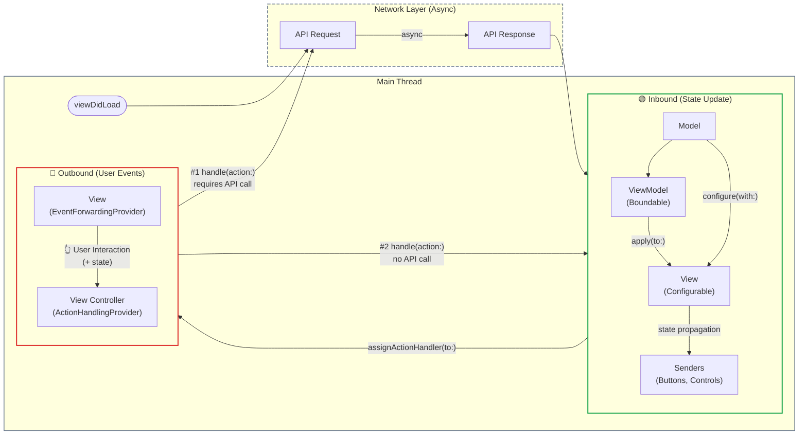
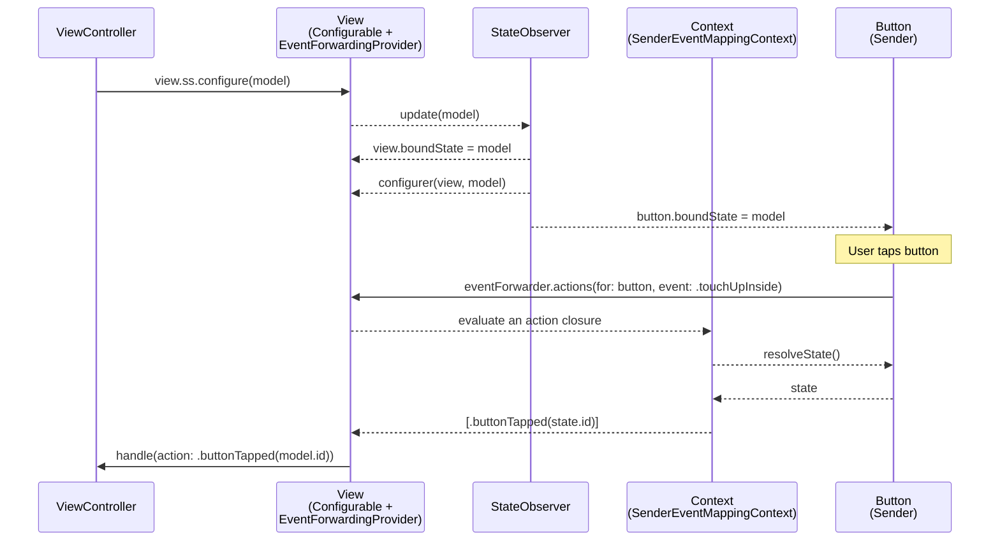
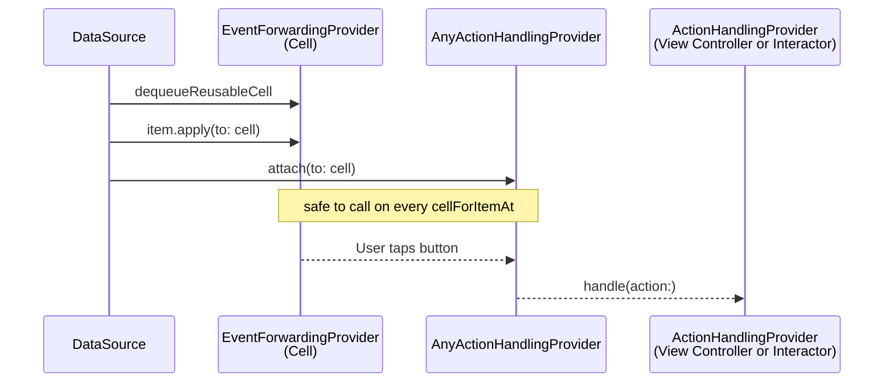

# SendingState

➡️ SendingState is a lightweight Swift framework that helps you cleanly structure UI components around three clear roles: configuring, binding, and forwarding user interactions — all in a predictable, one-way flow.

[](https://swift.org/package-manager/)   [](LICENSE)

## Purpose

**SendingState** provides a consistent pattern for UI components to receive state and forward user interactions through unidirectional data flow.

It defines two main channels:

- **🟢 Inbound (Configurable + Boundable)**
  Components receive models for configuration. View models deliver state snapshots to views through one-way binding. The configured state is automatically propagated to all senders (buttons, controls).

- **🔴 Outbound (EventForwarder)**
  User interactions are forwarded as declarative actions. Action closures can access the bound state directly — no manual state passing needed.




## Philosophy

SendingState is built on one belief: **most UI doesn't need a reactive stream.**

Frameworks like RxSwift and Combine are powerful — they model asynchronous data as continuous streams and give you operators to transform, combine, and throttle them. But that power comes at a cost: a learning curve, a dependency, and conceptual overhead that many apps simply don't need.

Think about a typical screen: you fetch data, hand it to a view, and the view renders it. That's not a stream — it's a one-shot delivery. The data isn't flowing in real time; it's sent once, and the view configures itself. For this pattern, a full reactive framework is overkill.

**SendingState takes a deliberately minimal approach:**

- **State is sent, not streamed.** A `Boundable` (view model) holds a snapshot of data and delivers it to a `Configurable` view. There is no subscription, no observation, no signal — just a direct, synchronous handoff.
- **No runtime overhead.** No publishers, no subscribers, no cancellables, no schedulers. Configuration is a plain function call.
- **One-way by design.** Data flows from model to view. User intent flows from view to handler. These two channels never cross.

Even for scenarios that feel "real-time" — like reflecting user input as they type — you don't need a reactive framework. A simple `NSKeyValueObservation` (KVO) is enough to observe property changes and feed them into SendingState:

```swift
observation = textField.observe(\.text) { [weak self] field, _ in
    let model = MyModel(text: field.text ?? "")
    self?.myView.ss.configure(model)
}
```

No publishers, no sinks, no `AnyCancellable` — just a plain observer that sends state to a view. This pattern covers most "live update" use cases (text fields, sliders, switches) without pulling in Combine.

If your app needs truly continuous data streams — live stock prices, WebSocket feeds, or continuous sensor data — use Apple's [Combine](https://developer.apple.com/documentation/combine) framework or structured concurrency with `AsyncSequence`. SendingState doesn't try to replace them; it covers the other 90% of UI work where you just need to send state to a view and move on.

---

When building data-driven UIs in Swift, it's common to fall into a mix of patterns — configuring views directly, reacting to user events with @IBAction, and juggling internal state inside UI components. These approaches often work… until your app scales. Then things get messy.

You start to wonder:
- Where should this logic live — in the view, the view controller, or the view model?
- Why does this button action still fire after the view was reused?
- Why are my components holding state they shouldn't?

**SendingState** brings structure and clarity to this chaos. It gives every component a clear way to receive state, bind view models, and forward user intent through a unidirectional pipeline.

The name reflects its core principle:

- **Send** models to views (configure)
- **Send** view models to views (bind)
- **Send** user events back (forward)

Let's look at what typically goes wrong when we mix UI, state, and logic without clear boundaries.

### 💣 The Usual UI Chaos

#### Business logic inside UI selectors

```swift
@objc func didTapConfirmButton(_ sender: UIButton) {
    guard user.isVerified else {
        showVerificationAlert()
        return
    }

    viewModel.proceedToNextStep(userID: user.id)
}
```

#### Problems:

- UI events are tightly coupled with application logic
- Hard to test, reuse, or refactor independently

#### Gesture handling with scattered selectors

```swift
@objc func handleTap() {
    self.tapGestureClosure?()
}

@objc func didTapButton(_ sender: UIButton) {
    self.didTapClosure?(sender)
}
```

#### Problems:

- Event logic is spread across multiple methods
- Hard to trace which UI triggers which action

#### Configurations that mutate passed-in state

```swift
class MyCell: UITableViewCell {
    private var data: MyData?

    func configure(_ data: MyData?) {
        self.data = data
        titleLabel.text = data?.title
        // also updates imageView, buttons, etc.
    }

    func changeData() {
        self.data?.title = "error"
    }
}
```

#### Problems:

- Stores and mutates input state internally
- Breaks unidirectional data flow
- Introduces side effects and hidden state changes

### 🛠️ With **SendingState**

#### Forward Events, Handle Actions in the Interactor

```swift
class MyCell: UITableViewCell, EventForwardingProvider {
    var eventForwarder: EventForwardable {
        SenderGroup {
            EventForwarder(button) { sender, ctx in
                ctx.control([.touchUpInside]) {
                    [MyAction.sendClickLog, .applyFilter(sender.tag)]
                }
            }
            EventForwarder(aView) { _, ctx in
                ctx.tapGesture() { [MyAction.sendClickLog] }
            }
            EventForwarder(slider) { sender, ctx in
                ctx.control(.valueChanged) {
                    [MyAction.sendClickLog, .changeSlider(sender.value)]
                }
            }
        }
    }
}

class MyInteractor: NSObject, ActionHandlingProvider {
    func handle(action: MyAction) {
        switch action {
        case .sendClickLog:
            // send click log
        case .applyFilter(let tag):
            // apply filter
        case .changeSlider(let value):
            // change slider
        }
    }
}
```

#### Benefits:

- Declarative event mapping with clear local definitions
- Views forward events, interactors handle logic
- Easy to add actions without touching UI code

#### Stateless configuration

```swift
class MyView: UIView, Configurable {
    var configurer: (MyView, MyModel) -> Void {
        { view, model in
            view.titleLabel.text = model.title
        }
    }
}

class MyViewController: UIViewController {
    func updateUI(with data: MyModel) {
        myView.ss.configure(data)
    }
}
```

#### Benefits:

- No internal state mutation
- Clear unidirectional data flow
- Decoupled and testable UI components

#### Safe binding

```swift
class MyViewController: UIViewController {
    func bindViewModel(with viewModel: MyViewModel) {
        viewModel.apply(to: myView)
    }
}
```

#### Benefits:

- View models control updates without modifying UI internals
- No retained or leaked state in views
- Easy to compose and swap view logic

---

## Usage

### Configurable:

1. Adopt the `Configurable` protocol in your view
2. Implement the **configurer** to define how the view updates with a model
3. Call `aView.ss.configure(model)` whenever you want to apply new data

Data flows in one direction only — from model to view. All closures are safely handled with no need to capture self or worry about memory leaks.

### Boundable:

1. After adopting `Configurable`, conform your view model to `Boundable`
2. Implement the binding logic so your view model can deliver state to the view
3. Use `viewModel.apply(to: view)` to apply the state

For collections of views driven by arrays of data, use `AnyBoundable` to erase types and bind them in a loop — no type gymnastics required.

### EventForwarder:

1. In views that handle user input (buttons, views with gestures), conform to `EventForwardingProvider`
2. Use `EventForwarder` blocks to declare which events trigger which actions
3. In your view controller or interactor, conform to `ActionHandlingProvider` and handle actions centrally
4. Use `aView.ss.addActionHandler(to: self.interactor)` to connect the flow
    
Your business logic is now cleanly separated and elegantly handled.

### State:

When you call `ss.configure(model)`, the model is automatically stored as **state** on both the view and all its senders (buttons, switches, etc.). This means your `EventForwarder` closures can access the configured data at event time — no manual state passing required.



#### Accessing state

On binder (Configurable) — the compiler infers the `Input` type automatically:

```swift
let model = cell.ss.state()  // → MyModel?
```

On sender (UIButton, etc.) — type annotation required:

```swift
let model: MyModel? = button.ss.state()
```

#### State-aware EventForwarder

Instead of manually calling `sender.ss.state()` inside closures, use the **state-aware overload** to receive typed state directly as a closure parameter:

```swift
class MyCell: UITableViewCell, Configurable, EventForwardingProvider {
    let button = UIButton()

    var configurer: (MyCell, MyModel) -> Void {
        { cell, model in
            cell.button.setTitle(model.title, for: .normal)
        }
    }

    var eventForwarder: EventForwardable {
        EventForwarder(button) { _, ctx in
            ctx.control(.touchUpInside) { (state: MyModel) in
                [MyAction.buttonTapped(state.id)]
            }
        }
    }
}
```

The state is resolved lazily at **event time** (when the user taps the button), not at setup time. This means it always reflects the latest configured model — even after cell reuse with new data.

All `SenderEventMappingContext` methods support both signatures:

```swift
// Without state — captures sender directly
ctx.control(.touchUpInside) {
    [MyAction.buttonTapped(sender.tag)]
}

// With state — receives typed model from boundState
ctx.control(.touchUpInside) { (state: MyModel) in
    [MyAction.buttonTapped(state.id)]
}
```

This also works with gesture mappings: `tapGesture`, `longPressGesture`, `swipeGesture`, `panGesture`, `pinchGesture`, `rotationGesture`, `screenEdgeGesture`, and `hoverGesture`.

#### Type-Erased Handler with `attach(to:)` / `detach(from:)`

When working with reusable cells (e.g. `UICollectionView`, `UITableView`), you often don't know the concrete cell type at the point of handler attachment. `AnyActionHandlingProvider` wraps any typed handler into a type-erased form, and its `attach(to:)` / `detach(from:)` instance methods solve the Swift existential limitation that prevents calling `view.ss.addAnyActionHandler(to:)` through a protocol composition existential.



```swift
// Wrap your typed handler once
let actionHandler = AnyActionHandlingProvider(interactor)

// In cellForItemAt — safe to call repeatedly on reused cells
func collectionView(_ collectionView: UICollectionView,
                    cellForItemAt indexPath: IndexPath) -> UICollectionViewCell {
    let cell = collectionView.dequeueReusableCell(
        withReuseIdentifier: identifier, for: indexPath
    )
    item.apply(to: cell)

    if let aCell = cell as? (UIView & EventForwardingProvider) {
        actionHandler.attach(to: aCell)
    }
    return cell
}
```

- **Idempotent** — calling `attach(to:)` multiple times on the same cell has no additional effect; no duplicate handlers accumulate
- **Existential-safe** — the generic parameter opens the existential type, bypassing Swift's limitation where `any UIView & EventForwardingProvider` cannot satisfy `Base: UIView & EventForwardingProvider`
- **Symmetric API** — use `detach(from:)` to remove the handler when needed

## Swift 6 Migration

> **Background.** SendingState was originally designed in 2020, prior to Swift's structured concurrency. Starting from v1.0.0, the entire UI-facing chain — `Configurable`, `EventForwardingProvider`, `EventForwardable` — is `@MainActor`-isolated, while `Boundable` requires `Sendable`. This means adopting the library in Swift 6 is straightforward for UIView subclasses.

### 1) `Configurable` — `@MainActor`

`Configurable` is `@MainActor`-isolated. UIView subclasses (which are themselves `@MainActor`) can adopt it directly with no extra boilerplate:

```swift
class MyCell: UITableViewCell, Configurable {
    var configurer: (MyCell, MyModel) -> Void {
        { cell, model in
            cell.label.text = model.text
            cell.label.font = UIFont.systemFont(ofSize: model.fontSize)
        }
    }
}
```

No `nonisolated`, no `Task { @MainActor in }`, no `DispatchQueue.main.async` — just write your configuration logic directly.

### 2) `Boundable` — `Sendable`

`Boundable` conforms to `Sendable`, so it can safely cross actor boundaries. Use a struct (recommended) for automatic `Sendable` conformance:

```swift
struct MyViewModel: Boundable {
    var contentData: MyModel?
    var binderType: MyCell.Type { MyCell.self }
}
```

If you need a class-based view model, declare `@unchecked Sendable` and protect mutable state:

```swift
final class MyViewModel: @unchecked Sendable, Boundable {
    var contentData: MyModel? {
        get { lock.lock(); defer { lock.unlock() }; return _contentData }
        set { lock.lock(); _contentData = newValue; lock.unlock() }
    }

    private let lock = NSLock()
    private var _contentData: MyModel?
    var binderType: MyCell.Type { MyCell.self }
}
```

### 3) `EventForwardingProvider` — `@MainActor`

`EventForwardingProvider` and `EventForwardable` are both `@MainActor`-isolated. UIView subclasses adopt them naturally — the same way as `Configurable`:

```swift
class MyCell: UITableViewCell, Configurable, EventForwardingProvider {
    var configurer: (MyCell, MyModel) -> Void { ... }

    var eventForwarder: EventForwardable {
        SenderGroup {
            EventForwarder(button) { sender, ctx in
                ctx.control(.touchUpInside) { [MyAction.buttonTapped(sender.tag)] }
            }
        }
    }
}
```

`SenderGroup`, `EventForwarder`, and all context builder types inherit `@MainActor` isolation, so the entire event declaration chain stays on the main actor without any annotation on your part.

### 4) `ActionHandlingProvider` — not `@MainActor`

`ActionHandlingProvider` is deliberately **not** `@MainActor`-isolated. While `handle(action:)` is called from the main thread (since the event forwarding chain is `@MainActor`), the protocol itself imposes no isolation constraint:

```swift
class MyInteractor: NSObject, ActionHandlingProvider {
    func handle(action: MyAction) {
        switch action {
        case .sendClickLog:
            analyticsService.log(.click)  // fire-and-forget, no isolation needed
        case .applyFilter(let tag):
            // already on main thread — safe to update UI-bound state
            viewModel.applyFilter(tag)
        }
    }
}
```

This means your handler can dispatch work freely — call into async services, fire analytics, or update state — without fighting isolation boundaries.

---

## Installation

SendingState is available via Swift Package Manager.

### Using Xcode:

1. Open your project in Xcode
2. Go to File > Add Packages…
3. Enter the URL:  
```
https://github.com/dSunny90/SendingState
```
4. Select the version and finish

### Using Package.swift:
```swift
dependencies: [
    .package(url: "https://github.com/dSunny90/SendingState", .upToNextMajor(from: "1.0.0"))
]
```
