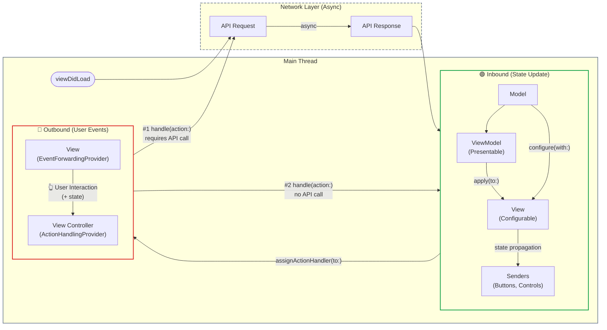

# SendingState

➡️ SendingState is a lightweight Swift framework that helps you cleanly structure UI components around three clear roles: configuring, binding, and forwarding user interactions — all in a predictable, one-way flow.

[](https://swift.org/package-manager/)   [](LICENSE)

## Purpose

**SendingState** provides a consistent pattern for UI components to receive state and forward user interactions through unidirectional data flow.

- **Configurable**: render state into a view
- **Presentable**: hold and apply state to a binder, with optional observation via `BindingStore`
- **EventForwarder**: map UI events to actions declaratively

> Inbound state flows into views, outbound user intent flows back as actions.


```mermaid
flowchart LR
    subgraph MainThread["Main Thread"]
        Start(["viewDidLoad"])

        subgraph Inbound["🟢 Inbound (State Update)"]
            direction TB
            Model["Model"] --> ViewModel["ViewModel<br/>(Presentable)"]
            ViewModel -->|"apply(to:)"| View1["View<br/>(Configurable)"]
            Model -->|"configure(with:)"| View1
            View1 -->|"state propagation"| Senders["Senders<br/>(Buttons, Controls)"]
        end

        subgraph Outbound["🔴 Outbound (User Events)"]
            direction TB
            View2["View<br/>(EventForwardingProvider)"] -->|"👆 User Interaction<br/>(+ state)"| ViewController["View Controller<br/>(ActionHandlingProvider)"]
        end
    end

    subgraph BgThread["Network Layer (Async)"]
        Request["API Request"] -->|"async"| Response["API Response"]
    end

    Start --> Request
    Response --> Inbound
    Inbound -->|"assignActionHandler(to:)"| Outbound

    Outbound -->|"#1 handle(action:)<br/>requires API call"| Request
    Outbound -->|"#2 handle(action:)<br/>no API call"| Inbound

    style Inbound stroke:#16a34a,stroke-width:2px
    style Outbound stroke:#dc2626,stroke-width:2px
    style MainThread stroke:#64748b,stroke-width:1.5px
    style BgThread stroke:#64748b,stroke-width:1.5px,stroke-dasharray: 6 3
```

---

## Usage

### Configurable:

1. Adopt the `Configurable` protocol in your view
2. Implement the **configurer** to define how the view updates with a model
3. Call `aView.ss.configure(model)` whenever you want to apply new data

The data flows in one direction only — from model to view.

```swift
struct ProfileModel {
    let name: String
}

final class ProfileView: UIView, Configurable {
    let titleLabel = UILabel()
    var configurer: (ProfileView, ProfileModel) -> Void {
        { view, model in
            view.titleLabel.text = model.name
        }
    }
}

let model = ProfileModel(name: "Sunny")
profileView.ss.configure(model)
```

No need to capture self or worry about memory leaks — all closures are safely handled.

### Presentable:

Sometimes rendering alone is not enough.  
A component may need to hold its current state and apply that state to a binder.

`Presentable` models that relationship.

1. Expose the current `state`
2. Implement `apply(to:)` to present that state to a binder
3. Use it when the relationship between state and binder needs to be enforced by the type system

`BindingStore` is a ready-made implementation of `Presentable` — it holds the current state, applies it to a binder, and notifies observers whenever that state changes.

You can implement `Presentable` directly for custom state holders, but if you also need observation, `BindingStore` is the natural starting point.

When you need to store heterogeneous `BindingStore` instances in a single collection, use `AnyBindingStore` to erase the concrete type — similar to how `AnyKeyPath` erases a key path's root and value types.

```swift
struct CounterModel: Equatable {
    let title: String
    var count: Int
}

final class CounterView: UIView, Configurable {
    let titleLabel = UILabel()
    let countLabel = UILabel()
    
    var configurer: (CounterView, CounterModel) -> Void {
        { view, model in
            view.titleLabel.text = model.title
            view.countLabel.text = "\(model.count)"
        }
    }

    @objc func didTapPlusButton() {
        self.ss.invalidateState { state in
            var newState = state
            newState.count += 1
            return newState
        }
    }
}

let store = BindingStore<CounterModel, CounterView>(
    state: CounterModel(title: "Product", count: 1)
)
store.apply(to: counterView)
let token = store.observe { updated in
    print(updated.count)
}
```

### EventForwardable:

1. In views that handle user input (buttons, views with gestures), conform to `EventForwardingProvider`
2. Use `EventForwarder` blocks to declare which events trigger which actions
3. In your view controller or interactor, conform to `ActionHandlingProvider` and handle actions centrally
4. Use `aView.ss.addActionHandler(to: self.interactor)` to connect the flow

```swift
final class ProductCell: UITableViewCell, EventForwardingProvider {
    let favoriteButton = UIButton(type: .system)
    let quantitySlider = UISlider()
    let containerView = UIView()

    var eventForwarder: EventForwardable {
        SenderGroup {
            EventForwarder(favoriteButton) { sender, ctx in
                ctx.control(.touchUpInside) {
                    [ProductAction.favoriteTapped(sender.tag)]
                }
            }
            EventForwarder(quantitySlider) { sender, ctx in
                ctx.control(.valueChanged) {
                    [ProductAction.quantityChanged(sender.value)]
                }
            }
            EventForwarder(containerView) { _, ctx in
                ctx.tapGesture {
                    [ProductAction.containerTapped]
                }
            }
        }
    }
}

final class ProductInteractor: NSObject, ActionHandlingProvider {
    func handle(action: ProductAction) {
        switch action {
        case .favoriteTapped(let index):
            print("favorite tapped: \(index)")
        case .quantityChanged(let value):
            print("quantity changed: \(value)")
        case .containerTapped:
            print("container tapped")
        }
    }
}
```

Your business logic is now cleanly separated and elegantly handled.

#### State-aware EventForwarder

Instead of manually calling `sender.ss.state()` inside closures, use the **state-aware overload** to receive typed state directly as a closure parameter:

```swift
class MyCell: UITableViewCell, Configurable, EventForwardingProvider {
    let button = UIButton()

    var configurer: (MyCell, MyModel) -> Void {
        { cell, model in
            cell.button.setTitle(model.title, for: .normal)
        }
    }

    var eventForwarder: EventForwardable {
        EventForwarder(button) { _, ctx in
            ctx.control(.touchUpInside) { (state: MyModel) in
                [MyAction.buttonTapped(state.id)]
            }
        }
    }
}
```

The state is resolved lazily at **event time** (when the user taps the button), not at setup time. This means it always reflects the latest configured model — even after cell reuse with new data.

All `SenderEventMappingContext` methods support both signatures:

```swift
// Without state — captures sender directly
ctx.control(.touchUpInside) {
    [MyAction.buttonTapped(sender.tag)]
}

// With state — receives typed model from boundState
ctx.control(.touchUpInside) { (state: MyModel) in
    [MyAction.buttonTapped(state.id)]
}
```

This also works with gesture mappings: `tapGesture`, `longPressGesture`, `swipeGesture`, `panGesture`, `pinchGesture`, `rotationGesture`, `screenEdgeGesture`, and `hoverGesture`.

---

## Philosophy

SendingState is built on one belief: **most UI doesn't need a reactive stream.**

Frameworks like RxSwift and Combine are powerful — they model asynchronous data as continuous streams and provide operators to transform, combine, and throttle them. But that power comes with a cost: extra concepts, extra types, and extra runtime machinery that many UI layers simply don't need.

A typical screen is much simpler. You fetch data, hand it to a view, and the view renders it. In many cases, that is not a stream — it is just state being applied to UI.

That is where **SendingState** stays intentionally small.

- **State is sent, not modeled as a stream.** A model is applied directly to a `Configurable` view.
- **No stream primitives are required.** No `Observable`, no `Publisher`, no `Relay`, no `AnyCancellable` — unless your use case actually needs them.
- **Configuration stays explicit.** Updating UI is still just a function call.

At the same time, SendingState is not limited to one-shot rendering.

With **BindingStore**, state can still react to UI-originated changes in a lightweight way.  
When a binder produces a new valid state through `invalidateState(_:)`, that value can be written back to its parent store and observed externally. In other words, SendingState can support reactive-style UI synchronization without turning your **entire** UI layer into a stream-based system.

This is the key difference:

- RxSwift / Combine model state as an ongoing stream with operators, schedulers, and disposal bags
- SendingState keeps state as a plain value — but still supports observer-based synchronization through BindingStore and StateObservationToken where it's needed

That means you can still build UI that feels reactive, while keeping the implementation small and direct. For example, `BindingStore` can propagate binder-originated state changes back to the parent model and notify observers, without introducing publishers or relays:

```swift
let token = store.observe { newValue in
    print("Updated count:", newValue.count)
}
```

Even for cases that feel “live”, you do not necessarily need a full reactive framework.  
A lightweight observer mechanism is often enough.

If your app truly depends on continuous streams — live market feeds, WebSocket pipelines, or high-frequency sensor updates — use Apple's Combine framework or structured concurrency with `AsyncSequence`. SendingState does not try to replace them.

Instead, it focuses on the larger category of UI work where:

- most state is still just applied directly to a view
- some parts need lightweight reactive synchronization
- and an observer pattern is enough without introducing full stream semantics

---

## Swift 6 Migration

> **Background.** SendingState was originally designed in 2020, prior to Swift's structured concurrency. Starting from 1.0.0, the entire UI-facing chain — `Configurable`, `EventForwardingProvider`, `EventForwardable` — is `@MainActor`-isolated. This means adopting the library in Swift 6 is straightforward for UIView subclasses.

### 1) `Configurable` — `@MainActor`

`Configurable` is `@MainActor`-isolated. UIView subclasses (which are themselves `@MainActor`) can adopt it directly with no extra boilerplate:

```swift
class MyCell: UITableViewCell, Configurable {
    var configurer: (MyCell, MyModel) -> Void {
        { cell, model in
            cell.label.text = model.text
            cell.label.font = UIFont.systemFont(ofSize: model.fontSize)
        }
    }
}
```

No `nonisolated`, no `Task { @MainActor in }`, no `DispatchQueue.main.async` — just write your configuration logic directly.

### 2) `Presentable`, `BindingStore`, `AnyBindingStore` — call `apply(to:)` on the main actor

`BindingStore` itself is not `@MainActor`-isolated, but `apply(to:)` must be called on the main actor because it configures UI-facing binders. In practice, calling it from a `UIViewController` is the natural and expected usage:

```swift
class MyViewController: UIViewController {
    private let store = BindingStore<MyModel, MyView>(state: MyModel())
    private var token: StateObservationToken?

    override func viewDidLoad() {
        super.viewDidLoad()

        store.apply(to: myView)

        token = store.observe { [weak self] updated in
            guard let self = self else { return }
            self.titleLabel.text = updated.title
        }
    }
}
```

`apply(to:)` should be invoked from the main actor because it drives UI configuration. When used from a `UIViewController`, no extra `DispatchQueue.main.async` wrapping is needed around the call.

### 3) `EventForwardingProvider` — `@MainActor`

`EventForwardingProvider` and `EventForwardable` are both `@MainActor`-isolated. UIView subclasses adopt them naturally — the same way as `Configurable`:

```swift
class MyCell: UITableViewCell, Configurable, EventForwardingProvider {
    var configurer: (MyCell, MyModel) -> Void { ... }

    var eventForwarder: EventForwardable {
        SenderGroup {
            EventForwarder(button) { sender, ctx in
                ctx.control(.touchUpInside) { [MyAction.buttonTapped(sender.tag)] }
            }
        }
    }
}
```

`SenderGroup`, `EventForwarder`, and all context builder types inherit `@MainActor` isolation, so the entire event declaration chain stays on the main actor without any annotation on your part.

### 4) `ActionHandlingProvider` — not `@MainActor`

`ActionHandlingProvider` is deliberately **not** `@MainActor`-isolated. While `handle(action:)` is called from the main thread (since the event forwarding chain is `@MainActor`), the protocol itself imposes no isolation constraint:

```swift
class MyInteractor: NSObject, ActionHandlingProvider {
    func handle(action: MyAction) {
        switch action {
        case .sendClickLog:
            analyticsService.log(.click)  // fire-and-forget, no isolation needed
        case .applyFilter(let tag):
            // already on main thread — safe to update UI-bound state
            viewModel.applyFilter(tag)
        }
    }
}
```

This means your handler can dispatch work freely — call into async services, fire analytics, or update state — without fighting isolation boundaries.

---

## Installation

SendingState is available via Swift Package Manager.

### Using Xcode:

1. Open your project in Xcode
2. Go to File > Add Packages…
3. Enter the URL:  
```
https://github.com/dSunny90/SendingState
```
4. Select the version and finish

### Using Package.swift:
```swift
dependencies: [
    .package(url: "https://github.com/dSunny90/SendingState", from: "1.0.0")
]
```
