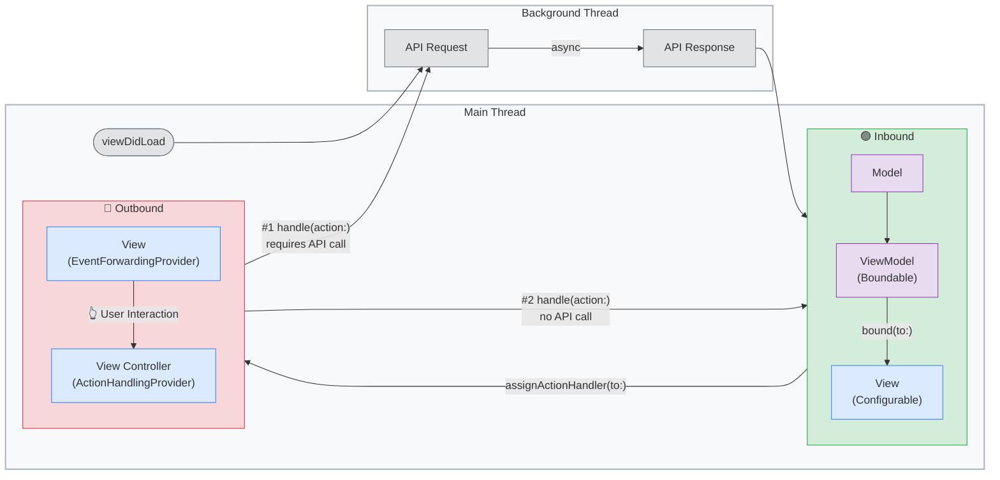
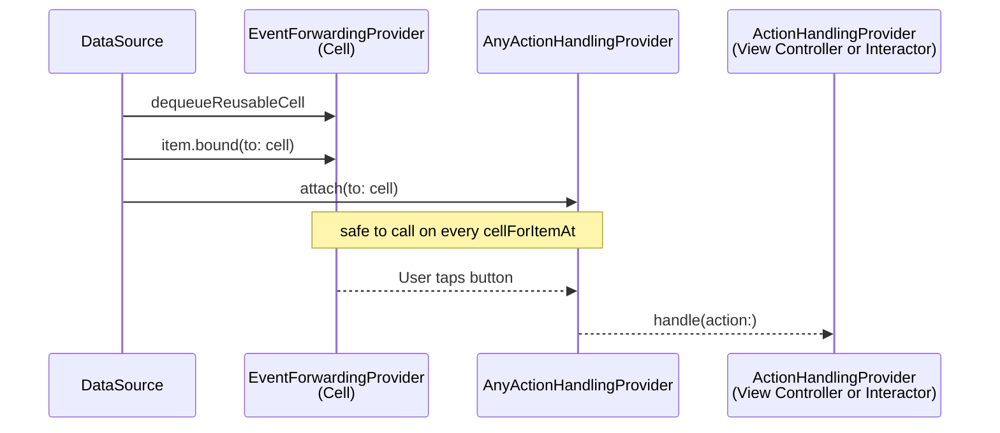

# SendingState

➡️ SendingState is a lightweight Swift framework that helps you cleanly structure UI components around three clear roles: configuring, binding, and forwarding user interactions — all in a predictable, one-way flow.

[](https://swift.org/package-manager/)   [](LICENSE)

## Purpose

**SendingState** provides a consistent pattern for UI components to receive state and forward user interactions through unidirectional data flow.

It defines two main channels:

- **🟢 Inbound (Configurable + Boundable)**  
  Components receive models for configuration and can bind to view models for continuous updates. 

- **🔴 Outbound (EventForwarder)**  
  User interactions are forwarded as declarative actions.  


```mermaid
flowchart LR
    subgraph MainThread["Main Thread"]
        Start(["viewDidLoad"])
        subgraph Inbound["🟢 Inbound"]
            direction TB
            Model["Model"] --> ViewModel["ViewModel\n(Boundable)"]
            ViewModel -->|"bound(to:)"| View1["View\n(Configurable)"]
        end
        subgraph Outbound["🔴 Outbound"]
            direction TB
            View2["View\n(EventForwardingProvider)"] -->|"👆 User Interaction"| ViewController["View Controller\n(ActionHandlingProvider)"]
        end
    end
    subgraph BgThread["Background Thread"]
        Request["API Request"] -->|"async"| Response["API Response"]
    end

    Start --> Request
    Response --> Inbound
    Inbound -->|"assignActionHandler(to:)"| Outbound
    Outbound -->|"#1 handle(action:)\nrequires API call"| Request
    Outbound -->|"#2 handle(action:)\nno API call"| Inbound

    style Start fill:#e2e3e5,stroke:#6c757d
    style MainThread fill:#f8f9fa,stroke:#adb5bd,stroke-width:2px
    style BgThread fill:#f8f9fa,stroke:#adb5bd,stroke-width:2px
    style Inbound fill:#d4edda,stroke:#28a745
    style Outbound fill:#f8d7da,stroke:#dc3545
    style Request fill:#e2e3e5,stroke:#6c757d
    style Response fill:#e2e3e5,stroke:#6c757d
    style Model fill:#e8daef,stroke:#8e44ad
    style ViewModel fill:#e8daef,stroke:#8e44ad
    style View1 fill:#dbeafe,stroke:#3b82f6
    style View2 fill:#dbeafe,stroke:#3b82f6
    style ViewController fill:#dbeafe,stroke:#3b82f6
```


When building data-driven UIs in Swift, it's common to fall into a mix of patterns — configuring views directly, reacting to user events with @IBAction, and juggling internal state inside UI components. These approaches often work… until your app scales. Then things get messy.

You start to wonder:
- Where should this logic live — in the view, the view controller, or the view model?
- Why does this button action still fire after the view was reused?
- Why are my components holding state they shouldn't?

**SendingState** brings structure and clarity to this chaos. It gives every component a clear way to receive state, bind view models, and forward user intent through a unidirectional pipeline.

The name reflects its core principle:

- **Send** models to views (configure)
- **Send** view models to views (bind)
- **Send** user events back (forward)

Let's look at what typically goes wrong when we mix UI, state, and logic without clear boundaries.

### 💣 The Usual UI Chaos

#### Business logic inside UI selectors

```swift
@objc func didTapConfirmButton(_ sender: UIButton) {
    guard user.isVerified else {
        showVerificationAlert()
        return
    }

    viewModel.proceedToNextStep(userID: user.id)
}
```

#### Problems:

- UI events are tightly coupled with application logic
- Hard to test, reuse, or refactor independently

#### Gesture handling with scattered selectors

```swift
@objc func handleTap() {
    self.tapGestureClosure?()
}

@objc func didTapButton(_ sender: UIButton) {
    self.didTapClosure?(sender)
}
```

#### Problems:

- Event logic is spread across multiple methods
- Hard to trace which UI triggers which action

#### Configurations that mutate passed-in state

```swift
class MyCell: UITableViewCell {
    private var data: MyData?

    func configure(_ data: MyData?) {
        self.data = data
        titleLabel.text = data?.title
        // also updates imageView, buttons, etc.
    }

    func changeData() {
        self.data?.title = "error"
    }
}
```

#### Problems:

- Stores and mutates input state internally
- Breaks unidirectional data flow
- Introduces side effects and hidden state changes

### 🛠️ With **SendingState**

#### Forward Events, Handle Actions in the Interactor

```swift
class MyCell: UITableViewCell, EventForwardingProvider {
    var eventForwarder: EventForwardable {
        SenderGroup {
            EventForwarder(button) { sender, ctx in
                ctx.control([.touchUpInside]) {
                    [MyAction.sendClickLog, .applyFilter(sender.tag)]
                }
            }
            EventForwarder(aView) { _, ctx in
                ctx.tapGesture() { [MyAction.sendClickLog] }
            }
            EventForwarder(slider) { sender, ctx in
                ctx.control(.valueChanged) {
                    [MyAction.sendClickLog, .changeSlider(sender.value)]
                }
            }
        }
    }
}

class MyInteractor: NSObject, ActionHandlingProvider {
    func handle(action: MyAction) {
        switch action {
        case .sendClickLog:
            // send click log
        case .applyFilter(let tag):
            // apply filter
        case .changeSlider(let value):
            // change slider
        }
    }
}
```

#### Benefits:

- Declarative event mapping with clear local definitions
- Views forward events, interactors handle logic
- Easy to add actions without touching UI code

#### Stateless configuration

```swift
class MyView: UIView, Configurable {
    var configurer: (MyView, MyModel) -> Void {
        { view, model in
            view.titleLabel.text = model.title
        }
    }
}

class MyViewController: UIViewController {
    func updateUI(with data: MyModel) {
        myView.ss.configure(data)
    }
}
```

#### Benefits:

- No internal state mutation
- Clear unidirectional data flow
- Decoupled and testable UI components

#### Safe binding

```swift
class MyViewController: UIViewController {
    func bindViewModel(with viewModel: MyViewModel) {
        viewModel.bound(to: myView)
    }
}
```

#### Benefits:

- View models control updates without modifying UI internals
- No retained or leaked state in views
- Easy to compose and swap view logic

---

## Usage

### Configurable:

1. Adopt the `Configurable` protocol in your view
2. Implement the **configurer** to define how the view updates with a model
3. Call `aView.ss.configure(model)` whenever you want to apply new data

Data flows in one direction only — from model to view. All closures are safely handled with no need to capture self or worry about memory leaks.

### Boundable:

1. After adopting `Configurable`, conform your view to `Boundable`
2. Implement the binding logic so your view model can update the view reactively
3. Use `viewModel.bound(to: view)` to connect them

For collections of views driven by arrays of data, use `AnyBoundable` to erase types and bind them in a loop — no type gymnastics required.

### EventForwarder:

1. In views that handle user input (buttons, views with gestures), conform to `EventForwardingProvider`
2. Use `EventForwarder` blocks to declare which events trigger which actions
3. In your view controller or interactor, conform to `ActionHandlingProvider` and handle actions centrally
4. Use `aView.ss.addActionHandler(to: self.interactor)` to connect the flow
    
Your business logic is now cleanly separated and elegantly handled.

#### Type-Erased Handler with `attach(to:)` / `detach(from:)`

When working with reusable cells (e.g. `UICollectionView`, `UITableView`), you often don't know the concrete cell type at the point of handler attachment. `AnyActionHandlingProvider` wraps any typed handler into a type-erased form, and its `attach(to:)` / `detach(from:)` instance methods solve the Swift existential limitation that prevents calling `view.ss.addAnyActionHandler(to:)` through a protocol composition existential.


```mermaid
sequenceDiagram
    participant DS as DataSource
    participant Cell as EventForwardingProvider<br/>(Cell)
    participant AH as AnyActionHandlingProvider
    participant H as ActionHandlingProvider<br/>(View Controller or Interactor)

    DS->>Cell: dequeueReusableCell
    DS->>Cell: item.bound(to: cell)
    DS->>AH: attach(to: cell)
    Note over AH,Cell: safe to call on every cellForItemAt

    Cell-->>AH: User taps button
    AH-->>H: handle(action:)
```

```swift
// Wrap your typed handler once
let actionHandler = AnyActionHandlingProvider(interactor)

// In cellForItemAt — safe to call repeatedly on reused cells
func collectionView(_ collectionView: UICollectionView,
                    cellForItemAt indexPath: IndexPath) -> UICollectionViewCell {
    let cell = collectionView.dequeueReusableCell(
        withReuseIdentifier: identifier, for: indexPath
    )
    item.bound(to: cell)

    if let aCell = cell as? (UIView & EventForwardingProvider) {
        actionHandler.attach(to: aCell)
    }
    return cell
}
```

- **Idempotent** — calling `attach(to:)` multiple times on the same cell has no additional effect; no duplicate handlers accumulate
- **Existential-safe** — the generic parameter opens the existential type, bypassing Swift's limitation where `any UIView & EventForwardingProvider` cannot satisfy `Base: UIView & EventForwardingProvider`
- **Symmetric API** — use `detach(from:)` to remove the handler when needed

## Swift 6 Migration

> **Background.** SendingState was originally designed in 2020, prior to Swift's structured concurrency. When using it in a Swift 6 / strict-concurrency environment, follow these guidelines.

### 1) `Configurable` (UIKit views/cells)

For UI types (e.g., `UITableViewCell`, `UIView`) that adopt `Configurable`, choose one of the following:

**A. Pre-concurrency conformance (easiest for migration)**

```swift
// (1) Optionally soften concurrency checks for this import
@preconcurrency import SendingState

// (2) Mark the *conformance* as preconcurrency
public final class MyCell: UITableViewCell, @preconcurrency Configurable {
    var configurer: (MyCell, MyModel) -> Void {
        { view, model in
            view.label.text = model.text
            view.label.font = UIFont.systemFont(ofSize: model.fontSize)
        }
    }
}
```

**B. Actor-aware conformance (preferred long-term)**

Expose a `nonisolated` configurer and hop to `MainActor` inside the closure.

```swift
@MainActor
public final class MyCell: UITableViewCell, Configurable {
    // Keep UI work on the main actor:
    nonisolated var configurer: (MyCell, MyModel) -> Void {
        { view, model in
            Task { @MainActor in
                view.label.text = model.text
                view.label.font = UIFont.systemFont(ofSize: model.fontSize)
            }
        }
    }
}
```

> Why: `nonisolated` allows callers to obtain and invoke configurer without an implicit hop, while the body still updates UI safely on `MainActor`.

### 2) `Boundable` (now Sendable)

Because `Boundable` conforms to `Sendable`, a class-based view model must ensure thread safety. If you keep it as a class, declare `@unchecked Sendable` and protect all mutable state (e.g., with `NSLock`). Avoid storing UI objects inside.

```swift
public final class MyViewModel: @unchecked Sendable, Boundable {
    public var contentData: MyModel? {
        get { lock.lock(); defer { lock.unlock() }; return _contentData }
        set { lock.lock(); _contentData = newValue; lock.unlock() }
    }

    private let lock = NSLock()
    private var _contentData: MyModel?
}
```

Alternative (recommended when possible): Make the view model a struct (value type) so `Sendable` is automatic and locks aren’t needed, or wrap shared mutable state in an actor.

---

## Installation

SendingState is available via Swift Package Manager.

### Using Xcode:

1. Open your project in Xcode
2. Go to File > Add Packages…
3. Enter the URL:  
```
https://github.com/dSunny90/SendingState
```
4. Select the version and finish

### Using Package.swift:
```swift
dependencies: [
    .package(url: "https://github.com/dSunny90/SendingState", from: "1.1.0")
]
```
